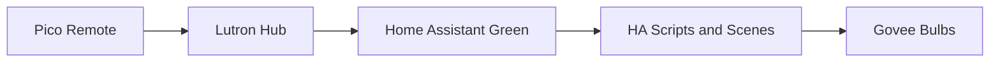

# Architecture

## Actual System Model

The first-floor lighting system uses Home Assistant Green as the decision-making layer, Lutron Pico remotes as the human interface, and Govee bulbs as the lighting endpoints.

The core architectural rule is that Pico remotes are preserving familiar wall-switch-style control without removing power from smart bulbs. The bulbs remain continuously powered, and button presses are translated by Home Assistant into explicit lighting actions.

## First-Floor Lighting Priorities

Current implementation focus:

- Kitchen
- Foyer
- Hallway

Planned or future-state:

- Living room Govee lighting
- Living room Pico
- Playroom Pico

Explicitly out of smart-lighting scope for now:

- Living room overhead fan light

## Kitchen Zone Model

- `kitchen_cans`
  4 can lights using local API bulbs
  This is the main kitchen task-lighting zone.
  It is controlled from 2 Pico locations.
- `kitchen_nook`
  3 fixture bulbs using cloud-only control
  This is a separate decorative or ambient zone.
- `kitchen_sink`
  1 can light above the sink using a local API bulb
  This is a separate single-light task zone.

## Reliability Rules

- Prefer explicit `on` and `off` actions over toggle logic.
- For multi-controller zones, do not use state-based toggle behavior.
- Prefer local API bulbs for critical paths such as cans, hallway, foyer, and sink task lighting.
- Keep the first rollout simple and predictable before layering on motion logic, scene cycling, or context-aware behavior.
- Mark future-state ideas clearly instead of mixing them into active automations.

## Behavior Layers

### Baseline Switch-Equivalent Behavior

- This is the day-one control layer.
- Each zone should have clear explicit `on` and `off` behavior.
- Pico presses should feel like familiar switch actions.
- Smart bulbs remain powered at all times.
- The baseline layer matters more than scenes.

### Future Scene Enhancements

- Scenes are optional additions after the baseline layer is stable.
- Scenes should not replace the baseline switch-equivalent behavior.
- Scene logic should stay simple and clearly labeled when it is not yet deployed.

### Future Adaptive Logic

- Motion logic, time-aware changes, and other adaptive behavior are future or draft unless explicitly promoted to current.
- Adaptive logic must not obscure the underlying explicit control model.
- AppDaemon is reserved for later only if YAML becomes awkward.

## Control Flow

1. A Pico button press is received by the Lutron integration.
2. Home Assistant interprets that event using room-specific automations.
3. Automations call explicit scripts or scenes for the target zone.
4. Scripts and scenes send commands to the correct Govee entities or zone groups.

## What This Repo Is For

- Documenting the intended room and zone behavior before deployment
- Tracking placeholder versus confirmed entity and device IDs
- Keeping current rollout work separate from future-state ideas

## Not In Use Yet

- AppDaemon-based control logic
- Complex abstraction layers
- Advanced motion or adaptive logic as a default design choice
