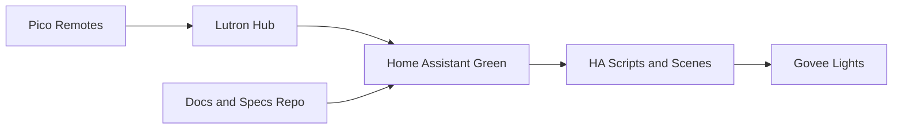

# Architecture

## Overview

This setup uses Home Assistant Green as the automation runtime, Lutron Pico remotes as the physical control layer, and Govee lights as the lighting endpoints.

## Design Principles

- Keep room behavior documented before it is automated.
- Prefer reusable scripts and scenes over duplicated actions in automations.
- Use AppDaemon only for logic that becomes awkward to express in YAML.
- Treat this repository as the planning and audit trail for production changes.

## Control Flow

1. A Pico remote button press is captured through the Lutron integration.
2. Home Assistant automation logic routes that event to a script or scene.
3. Scripts call `light.turn_on` or `light.turn_off` against Govee entities or groups.
4. Room specs in `docs/automation-specs/` define the expected behavior for each room.

## Open Decisions

- Final entity naming convention inside Home Assistant.
- Whether grouped Govee lights should be represented as light groups, scenes, or both.
- Whether advanced button behaviors should live in YAML or AppDaemon.
